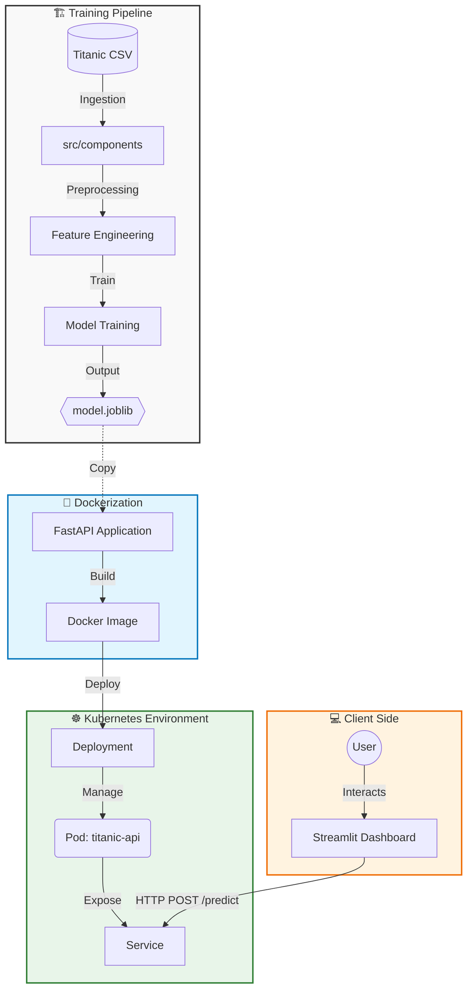

# 🚢 End-to-End Titanic MLOps Project


A production-ready Machine Learning pipeline for predicting Titanic survival, deployed on **Kubernetes** using **Docker** and **FastAPI**.

## 🚀 Features
* **Modular Pipeline:** Refactored Jupyter Notebooks into a scalable `src` architecture (Data Ingestion, Transformation, Training).
* **Rest API:** High-performance model serving with **FastAPI** & **Pydantic** validation.
* **Containerization:** Fully Dockerized application ensuring consistency across environments.
* **Orchestration:** Deployed on **Minikube (Kubernetes)** with custom Deployment & Service manifests.
* **Frontend:** Interactive dashboard built with **Streamlit**.
* **CI/QA:** Automated testing with `pytest`.

---

## 🛠️ Tech Stack
* **ML:** Scikit-learn, Pandas, Joblib
* **Backend:** FastAPI, Uvicorn
* **Infrastructure:** Docker, Kubernetes (Minikube)
* **Testing:** Pytest



---

<p align="center">
  
</p>

---

## 📂 Project Structure
The project follows a modular architecture to separate concerns (Training vs. Inference):

```text
titanic-mlops-k8s/
├── .github/
│   └── workflows/
│       └── deploy.yml      # CI/CD Pipeline for AWS Deployment
├── k8s/                     # Kubernetes Manifests (Deployment & Service)
├── src/
│   ├── api/                 # FastAPI Application (Entry point)
│   ├── components/          # ML Pipeline Components (Ingestion, Transformation)
│   ├── pipelines/           # Training Pipelines
│   └── ui/                  # Streamlit Dashboard Code
├── tests/                   # Pytest Unit Tests
├── .dockerignore            
├── .gitignore
├── Dockerfile               # Multi-stage Docker Build
├── docker-compose.yml       # Container Orchestration (Local & Prod) 
├── requirements.txt         # Project Dependencies
└── params.yaml              # Configuration Controller
```

---

## 📦 How to Run

### 1. Load the project
```bash
git clone https://github.com/enesgulerml/titanic-mlops-k8s.git
cd titanic-mlops-k8s
```

### 2. Local Development (Python)
If you want to run the components separately for development:
```bash
# Start Backend
uvicorn src.api.app:app --reload

# Start Frontend (In another terminal)
streamlit run src/ui/dashboard.py
```

### 3. Local Deployment (Docker Compose) - RECOMMENDED
The easiest way to run the entire stack (API + UI) with a single command:
```bash
# Build and Start
docker-compose up --build
```
Access the Dashboard at: http://localhost

### 4. Kubernetes (Local Test)
To test the orchestration layer locally:
```bash
minikube start
kubectl apply -f k8s/
kubectl get pods
```


