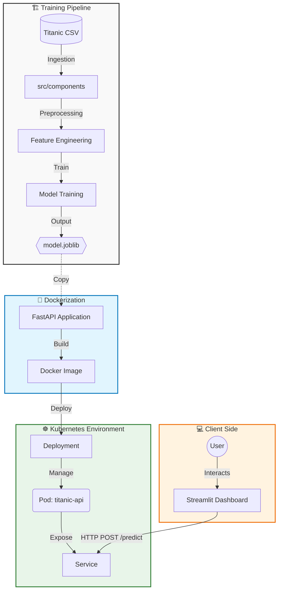

# 🚢 End-to-End Titanic MLOps Project


A production-ready Machine Learning pipeline for predicting Titanic survival, deployed on **Kubernetes** using **Docker** and **FastAPI**.

## 🚀 Features
* **Modular Pipeline:** Refactored Jupyter Notebooks into a scalable `src` architecture (Data Ingestion, Transformation, Training).
* **Rest API:** High-performance model serving with **FastAPI** & **Pydantic** validation.
* **Containerization:** Fully Dockerized application ensuring consistency across environments.
* **Orchestration:** Deployed on **Minikube (Kubernetes)** with custom Deployment & Service manifests.
* **Frontend:** Interactive dashboard built with **Streamlit**.
* **CI/QA:** Automated testing with `pytest`.

---

## 🛠️ Tech Stack
* **ML:** Scikit-learn, Pandas, Joblib
* **Backend:** FastAPI, Uvicorn
* **Infrastructure:** Docker, Kubernetes (Minikube)
* **Testing:** Pytest



---

## 📂 Project Structure
The project follows a modular architecture to separate concerns (Training vs. Inference):

```text
titanic-mlops-k8s/
├── k8s/                     # Kubernetes Manifests (Deployment & Service)
├── src/
│   ├── api/                 # FastAPI Application (Entry point)
│   ├── components/          # ML Pipeline Components (Ingestion, Transformation)
│   ├── pipelines/           # Training Pipelines
│   └── ui/                  # Streamlit Dashboard Code
├── tests/                   # Pytest Unit Tests
├── Dockerfile               # Multi-stage Docker Build
├── requirements.txt         # Project Dependencies
└── params.yaml              # Configuration Controller
```

---

## 📦 How to Run

### 1. Run with Docker
```bash
docker build -t titanic-api:v1 .
docker run -p 8000:8000 titanic-api:v1
```

### 2. Deploy to Kubernetes
```bash
minikube start
minikube image load titanic-api:v1
kubectl apply -f k8s/deployment.yaml
# Access the API
minikube service titanic-service --url
```

### 3. Run Dashboard
```bash
streamlit run src/ui/dashboard.py
```

